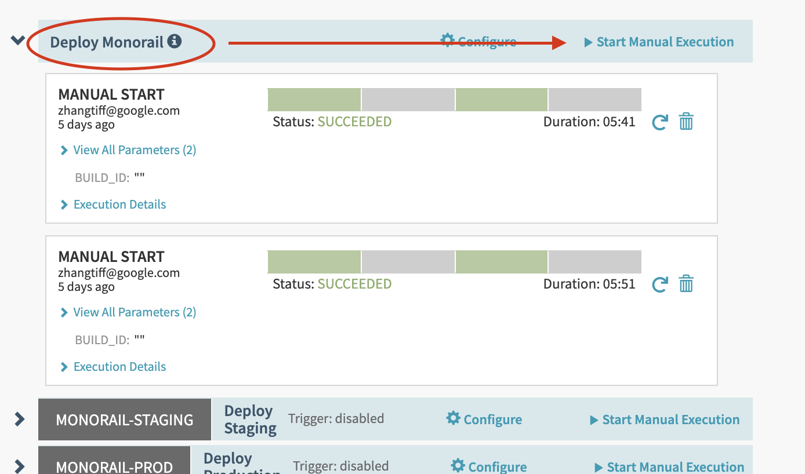

# Monorail Deployment

## Before your first deployment

Spinnaker is a platform that helps teams configure and manage application
deployment pipelines. We have a [ChromeOps Spinnaker](go/chrome-infra-spinnaker)
instance that holds pipelines for several ChromeOps services, including
Monorail.

IMPORTANT: In the event of an unexpected failure in a Spinnaker pipeline, it is
extremely important that the release engineer properly cleans up versions in the
Appengine console (e.g. delete bad versions and manual rollback to previous
version).

Spinnaker's traffic splitting, rollback, and cleanup systems rely heavily on the
assumption that the currently deployed version always has the highest version
number. During Rollbacks, Spinnaker will migrate traffic back to the second
highest version number and delete the highest version number. So, if the
previous deployed version was v013 and there was a v014 that was created but
somehow never properly deleted, and Spinnaker just created a v015, which it is
now trying to rollback, this means, spinnaker will migrate 100% traffic "back"
to v014, which might be a bad version, and delete v015. The same could happen
for traffic migrations. If a previous, good deployment is v013 with 100%
traffic, and there is a bad deployment at v014 that was never cleaned up, during
a new deployment, Spinnaker will have created v015 and begin traffic splitting
between v014 and v015, which means our users are either being sent to the bad
version or the new version.

If you are ever unsure about how you should handle a manual cleanup and
rollback, ping the [Monorail chat](http://chat/room/AAAACV9ZZ8k) and ask for
help.

Below are brief descriptions of all the pipelines that make up the Monorail
deployment process in Spinnaker.

#### Deploy Monorail

This is the starting point of the Monorail deployment process. This is the only
Pipeline that needs to be manually triggered by the Release Engineer.
 With the default parameters, an empty
"BUILD_ID" and "ENV" set to "staging", "Deploy Monorail" triggers a Cloud Build
of Monorail from HEAD. And when this pipeline finishes, the "Deploy Staging"
pipeline automatically begins.

"Deploy Monorail" accepts a "BUILD_ID" parameter, which should be the id of a
previous Cloud Build found
[here](https://pantheon.corp.google.com/cloud-build/builds?organizationId=433637338589&src=ac&project=chrome-infra-spinnaker).
If "ENV" is set to "prod", the "Deploy Prod" pipeline is automatically triggered
with a successful finish of "Deploy Monorail"

#### Deploy Staging

This pipeline handles deploying a new monorail-staging version and migrating
traffic to the newest version.

After a new version is created, but before traffic is migrated, there is a
"Continue?" stage that waits on manual judgement. The release engineer is
expected to any required manual testing in the newest version before confirming
that the pipeline should continue with traffic migration. If any issues are
spotted during this, the release engineer should select "Rollback", which
triggers the "Rollback" pipeline. 
 If "Continue" is selected, spinnaker will
proceed with three stages of traffic splitting with a waiting period between
each traffic split.

The successful finish of this pipeline triggers two pipelines: "Cleanup" and
"Deploy Production".

#### Deploy Production

This pipeline handles deploying a new monorail-prod version and migrating
traffic to the newest version.

Like the "Deploy Staging" pipeline, this pipeline has a "Continue?" stage that
waits on manual judgement. If any issues are spotted during this, the release
engineer should select "Rollback", which triggers the "Rollback" pipeline.

If "Continue" is selected, spinnaker will proceed with three stages of traffic
splitting with a waiting period between each traffic split.

The successful finish of this pipeline triggers the "Cleanup" pipeline.

#### Rollback

This pipeline handles migrating traffic back from the newest version to the
previous version and deleting the newest version.

#### Cleanup

This pipeline handles deleting the oldest version.

For more details read [go/monorail-deployments](go/monorail-deployments) and
[go/chrome-infra-appengine-deployments](go/chrome-infra-appengine-deployments]

TODO(jojwang): Currently, notifications are not working. See
[crbug/monorail/5964](https://bugs.chromium.org/p/monorail/issues/detail?id=5964).

### Notifications

Monorail's pipelines in Spinnaker have been configured to send notifications to
monorail-eng+spinnaker@google.com when:

1.  Any Monorail pipeline fails
1.  "Deploy Staging" requires manual judgement at the "Continue?" stage.
1.  "Deploy Production" requires manual judgement at the "Continue?" stage.

### Cron Jobs and Task

The pipelines currently do not update cron jobs or task queues. See
[crbug/monorail/5965](https://bugs.chromium.org/p/monorail/issues/detail?id=5965).

## Deploying a new version to an existing instance using Spinnaker

### Deployment steps

If any step below fails. Stop the deploy and ping
[Monorail chat](http://chat/room/AAAACV9ZZ8k).

1.  Prequalify
    1.  Check for signs of trouble
        1.  [go/cit-hangout](http://go/cit-hangout)
        1.  [Viceroy](http://go/monorail-prod-viceroy)
        1.  [go/devx-pages](http://go/devx-pages)
        1.  [GAE dashboard](https://console.cloud.google.com/appengine?project=monorail-prod&duration=PT1H)
        1.  [Error Reporting](http://console.cloud.google.com/errors?time=P1D&order=COUNT_DESC&resolution=OPEN&resolution=ACKNOWLEDGED&project=monorail-prod)
    1.  If there are any significant operational problems with Monorail or ChOps
        in general, halt deploy.
1.  Update Staging Schema
    1.  Check for changes since last deploy: `tail -30
        schema/alter-table-log.txt`
    1.  Copy and paste the new changes into the
        [master DB](http://console.cloud.google.com/sql/instances/master-g2/overview?project=monorail-staging)
        in staging. Please be careful when pasting into SQL prompt.
    1.  Also copy and paste updates to the
        [master DB](http://console.cloud.google.com/sql/instances/master-g2/overview?project=monorail-dev)
        in the `monorail-dev` project.
1.  Start the deployment Pipeline in Spinnaker
    1.  Navigate to the Monorail Delivery page at
        [go/spinnaker-deploy-monorail](https://spinnaker-1.endpoints.chrome-infra-spinnaker.cloud.goog/#/applications/monorail/executions)
        in Spinnaker.
    1.  Identify the "Deploy Monorail" Pipeline and click "Start Manual
        Execution". "BUILD_ID" should be empty. "ENV" should be set to
        "staging".
1.  Test on Staging (Pipeline: "Deploy Staging", Stage: "Continue?")
    1.  If there are any new tasks or cron jobs, run `gcloud app deploy
        queue.yaml cron.yaml --project monorail-staging`
    1.  For each commit since last deploy, verify affected functionality still
        works.
        1.  Test using a non-admin account, unless you're verifying
            admin-specific functionality.
        1.  If you rolled back a previous attempt, make sure you test any
            changes that might have landed in the mean time.
    1.  If everything looks good, choose "Continue" for this stage.
    1.  If there is an issue, choose "Rollback" for this stage.
1.  Update Prod Schema
    1.  Repeat the same schema changes on the prod database.
    1.  If there are any new tasks or cron jobs, run `gcloud app deploy
        queue.yaml cron.yaml --project monorail-prod`
1.  Test on Prod (Pipeline: "Deploy Production", Stage: "Continue?")
    1.  For each commit since last deploy, verify affected functionality still
        works. Test using a non-admin account, unless you're verifying
        admin-specific functionality.
    1.  Add a comment to an issue.
    1.  Enter a new issue and CC your personal account.
    1.  Verify that you got an email (at the "all" email address specified in
        settings.py).
    1.  Try doing a query that is not cached, then repeat it to test the cached
        case.
    1.  If everything looks good, choose "Continue" for this stage.
    1.  If there is an issue, choose "Rollback" for this stage.
1.  Monitor Viceroy and Error Reporting
    1.  Modest latency increases are normal in the first 10-20 minutes
    1.  Check
        [/p/chromium updates page](https://bugs.chromium.org/p/chromium/updates/list).
    1.  [Chromiumdash](https://chromiumdash.appspot.com/release-manager?platform=Android),
        should work after deployment.
1.  Announce the Deployment.
    1.  Include the build id of the Cloud Build that was used for this
        deployment.
    1.  Include the version numbers of the new staging and prod deployments.
        (They may be different).
    1.  Copy changes since last deploy: `git log --oneline .`
1.  Add a new row to the
    [Monorail Deployment Stats](http://go/monorail-deployment-stats) spreadsheet
    to help track deploys/followups/rollbacks. It is important to do this even
    if the deploy failed for some reason.

## Creating and deploying a new Monorail instance

1.  Create new GAE apps for production and staging.
1.  Configure GCP billing.
1.  Create new master DBs and 10 read replicas for prod and staging.
    1.  Set up IP address and configure admin password and allowed IP addr.
        [Instructions](https://cloud.google.com/sql/docs/mysql-client#configure-instance-mysql).
    1.  Set up backups on master. The first backup must be created before you
        can configure replicas.
1.  Fork settings.py and configure every part of it, especially trusted domains
    and "all" email settings.
1.  You might want to also update `*/*_constants.py` files.
1.  Set up log saving to bigquery or something.
1.  Set up monitoring and alerts.
1.  Set up attachment storage in GCS.
1.  Set up spam data and train models.
1.  Fork and customize some of HTML in templates/framework/master-header.ezt,
    master-footer.ezt, and some CSS to give the instance a visually different
    appearance.
1.  Get From-address whitelisted so that the "View issue" link in Gmail/Inbox
    works.
1.  Set up a custom domain with SSL and get that configured into GAE. Make sure
    to have some kind of reminder system set up so that you know before cert
    expire.
1.  Configure the API. Details? Allowed clients are now configured through
    luci-config, so that is a whole other thing to set up. (Or, maybe decide not
    to offer any API access.)
1.  Gain permission to sync GGG user groups. Set up borgcron job to sync user
    groups. Configure that job to hit the API for your instance. (Or, maybe
    decide not to sync any user groups.)
1.  Monorail does not not access any internal APIs, so no whitelisting is
    required.
1.  For projects on code.google.com, coordinate with that team to set flags to
    do per-issue redirects from old project to new site. As each project is
    imported, set it's moved-to field.
