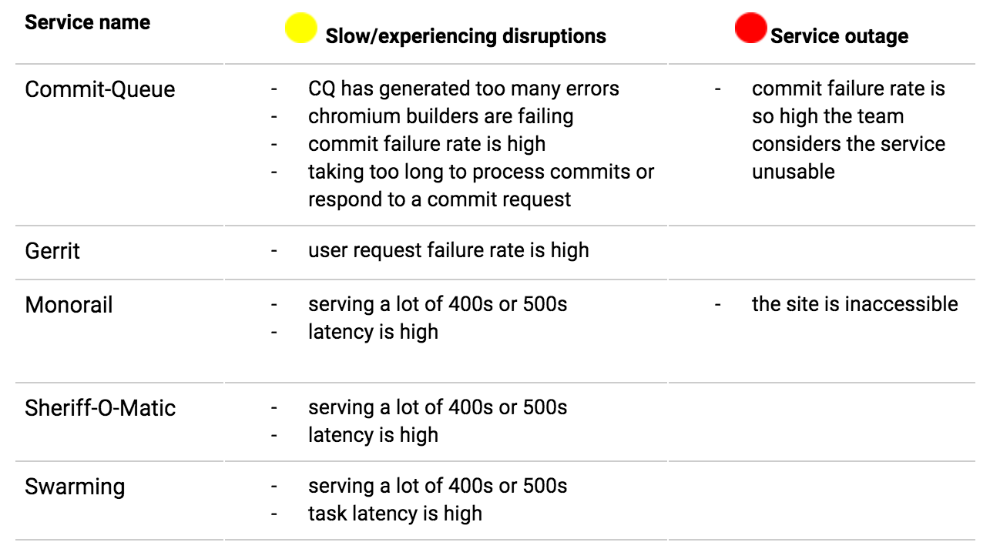

# ChOps Dash: Detailed Status Definitions

The Chrome Operations dashboard statuses are based on alerts that our team has set up to monitor each service. When an an alert fires a team member and the dashboard are notified on the issue.

Below is a summary of what the alerts monitor and the possible causes for a service status being red or yellow. This table will grow as our team adds more alerts to our services and more services to the status dashboard.

